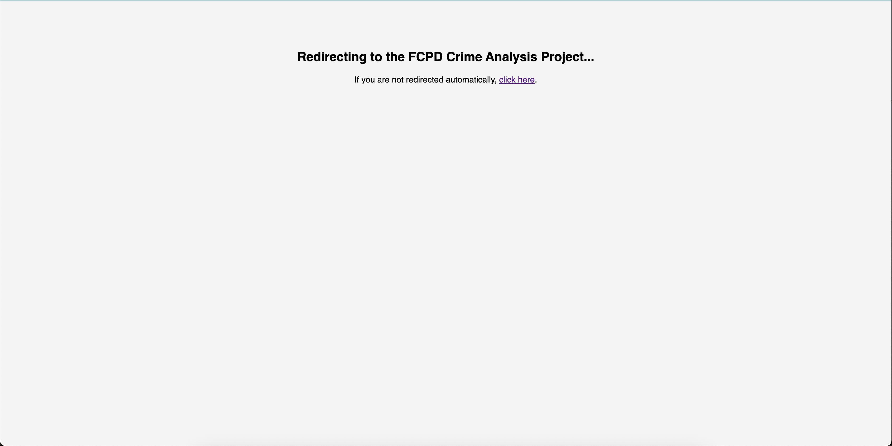
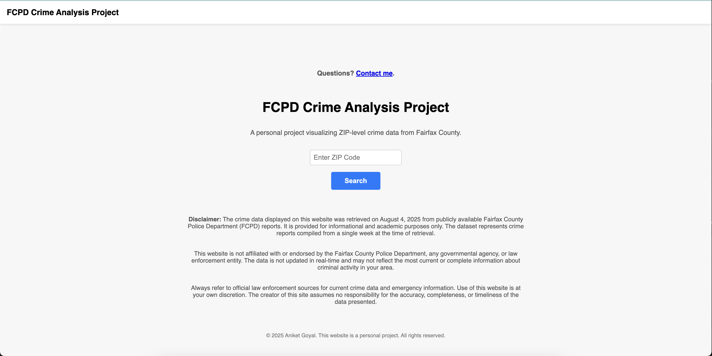
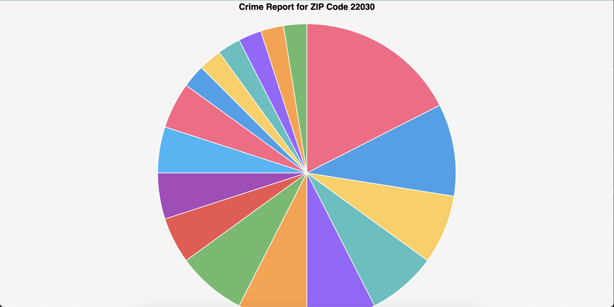
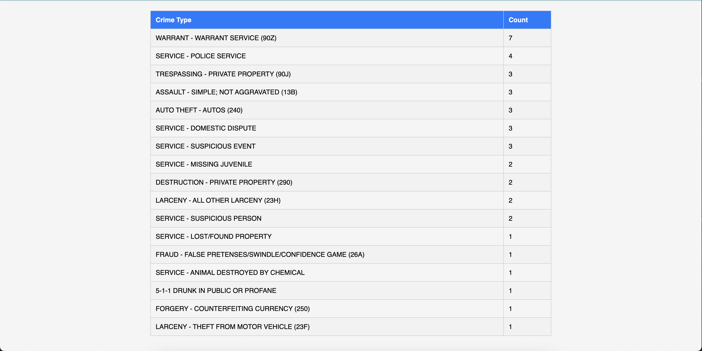

# FCPD Crime Analyis Project
This project began as a Python script (`FCPDCrime_Report.py`) used to explore and summarize crime data. It has since evolved into a fully functioning web application that allows user input, dynamic rendering, and real-time charting through Flask and JavaScript. Although simple it 

**Live App**: [https://mason.gmu.edu/~agoyal23/fcpd_project/](https://mason.gmu.edu/~agoyal23/fcpd_project/)
**Data Date**: Week of August 4, 2025  
**Source**: Publicly available reports from the Fairfax County Police Department (FCPD)

# Features

- ZIP code search for localized crime reports
- Interactive pie chart of offenses (via Chart.js)
- Summary: total crimes + most frequent crime
- Table showing offense type breakdown
- Simple navigation with back-to-search button
- Disclaimer clearly noted on results page

# Technologies Used

- **Flask** – backend web framework  
- **pandas** – for CSV processing and data filtering  
- **Chart.js** – for frontend data visualization  
- **HTML/CSS** – for responsive design and layout  
- **Render** – for deployment of the full Flask app

# Lessons I Learned

Throughout this project, I deepened my understanding of how to bridge backend data processing with dynamic frontend visualization. I learned how to build a functional Flask application from scratch, filter datasets using pandas, and render real-time data to users in a clean, visual format with Chart.js.

I also learned how to:
- Structure a full-stack web project using Flask and Jinja templates
- Deploy a live Python application using GitHub and Render
- Work through real-world deployment challenges like port binding, environment variables, and authentication

#Developer

Created by **Aniket Goyal** as a personal project to demonstrate web development, data analysis, and deployment skills.  
Feel free to explore the code or view the live app above.
